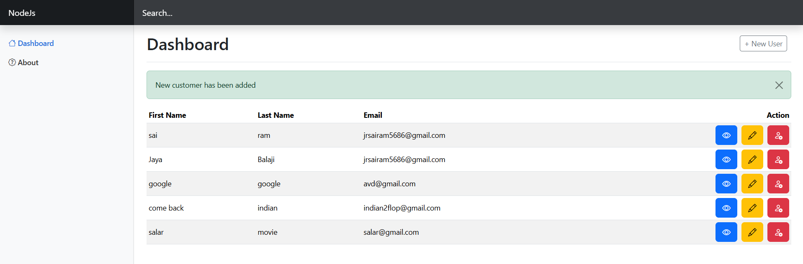

# 🧑‍💻 User Management System

## 🌟 Overview

The **User Management System** is a web application built with **HTML**, **CSS**, **JavaScript**, and **Node.js**. It provides a platform for managing users, enabling CRUD (Create, Read, Update, Delete) operations with a clean and user-friendly interface. The backend uses **Express.js** for routing and **MongoDB** as the database.

---

## ✨ Features

✔️ Add new users  
✔️ View a list of users  
✔️ Update user details  
✔️ Delete users  
✔️ Interactive and responsive UI  
✔️ Real-time data fetching using **Fetch API**  

---

## 🔧 Technologies Used

- 🌐 **Frontend**: HTML, CSS, JavaScript, EJS (for templating)  
- 🛠️ **Backend**: Node.js, Express.js  
- 🗄️ **Database**: MongoDB  
- 🔄 **Fetch API**: For real-time data interaction between client and server  

---

